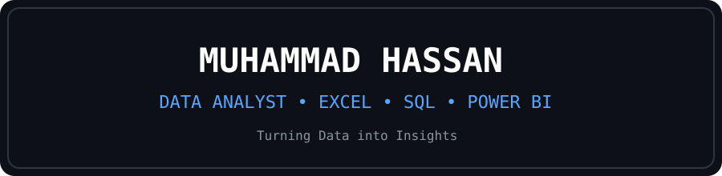

<p align="center">
  
</p>
# Hi, I'm Muhammad Hassan

### 📊 Aspiring Data Analyst | Excel | SQL | Python | Power BI

I am currently learning Data Analytics and building practical projects using real-world datasets.

I enjoy turning raw data into meaningful insights and developing my skills in data cleaning, analysis, visualization, and reporting.

---

## 👨‍💻 About Me

- 🎓 Currently building my foundation in Computer Science & Data Analytics
- 📊 Learning Data Analysis through practical projects
- 📈 Interested in Data Analytics, Business Intelligence & Data Science
- 💻 Currently working with Microsoft Excel
- 🌱 Currently learning SQL, Python & Power BI
- 🎯 Goal: Become a professional Data Analyst

---

## 🛠️ Skills

### 📊 Data Analytics


### 🎨 Graphic Design


### 🎯 UI/UX Design


### 🎬 Video Animation


### 🧰 Tools


---

## 📂 Featured Projects

### 🦶 Bigfoot Sightings Analysis

Exploratory analysis of historical Bigfoot sighting records using Microsoft Excel.

**Skills demonstrated:**
- Data Cleaning
- Pivot Tables
- Trend Analysis
- Data Visualization
- Exploratory Data Analysis

🔗 [View Project](https://github.com/Hassan-Insights/New-repo)

---

### 🚲 Bike Sales Analysis

Analysis of bike sales data to understand customer purchasing behavior and sales patterns.

**Skills demonstrated:**
- Data Cleaning
- Pivot Tables
- Customer Analysis
- Sales Analysis
- Data Visualization

🔗 [View Project](https://github.com/Hassan-Insights/New-repo)

---

## 📈 What I'm Currently Learning

```text
Excel
  ↓
SQL
  ↓
Power BI
  ↓
Python
  ↓
Statistics
  ↓
Advanced Data Analytics
🎯 My Goal

To build strong skills in:

Data Analysis → Business Intelligence → Data Science

and create real-world projects that demonstrate my ability to solve problems using data.
